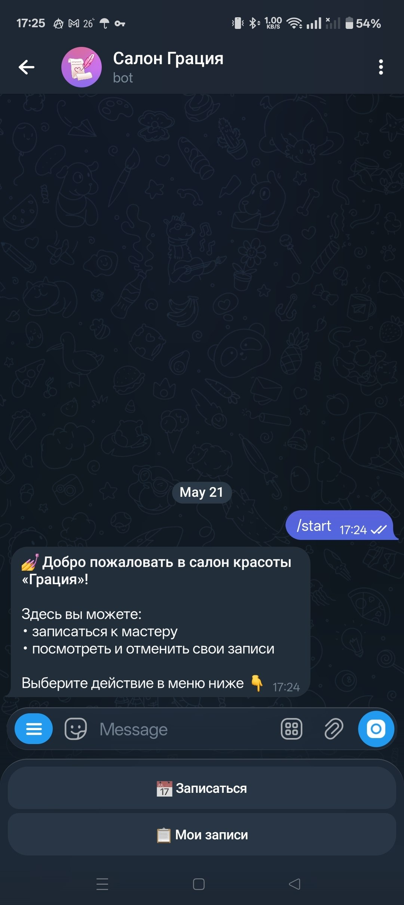
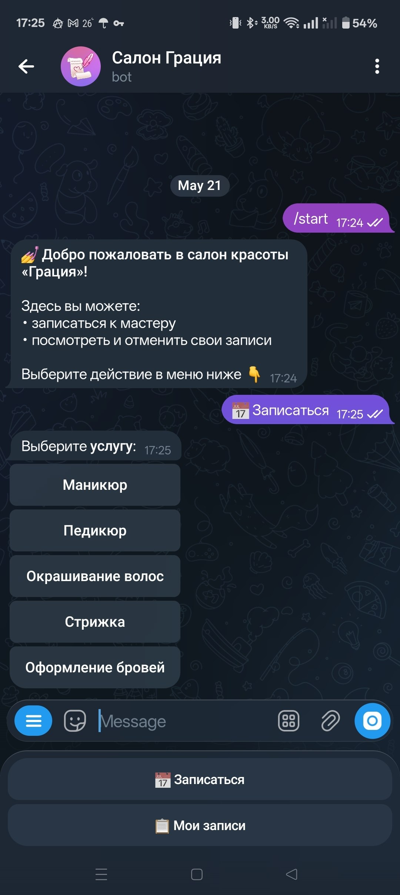
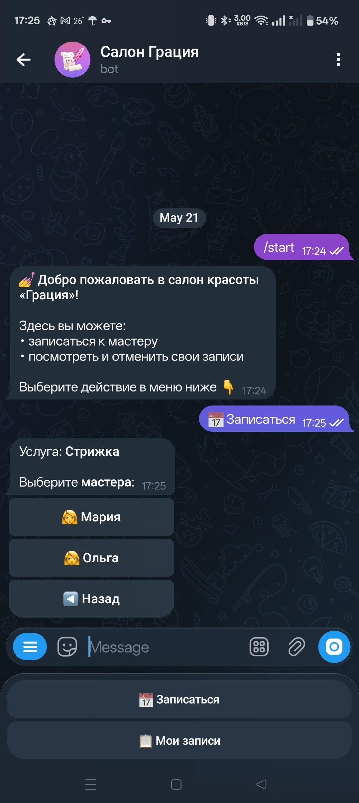
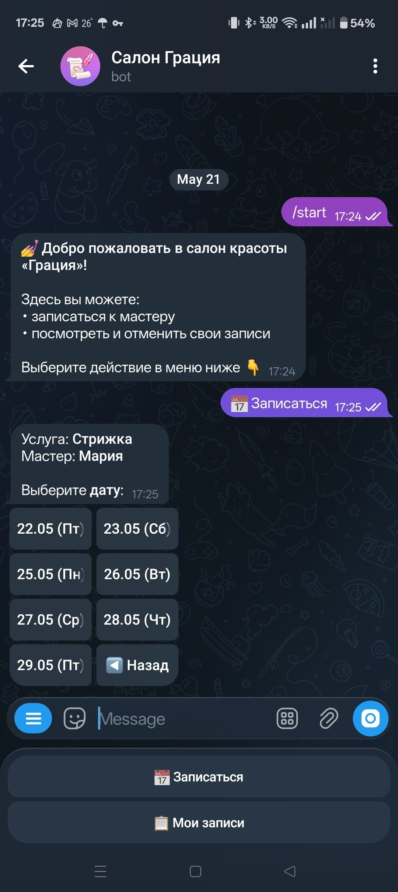
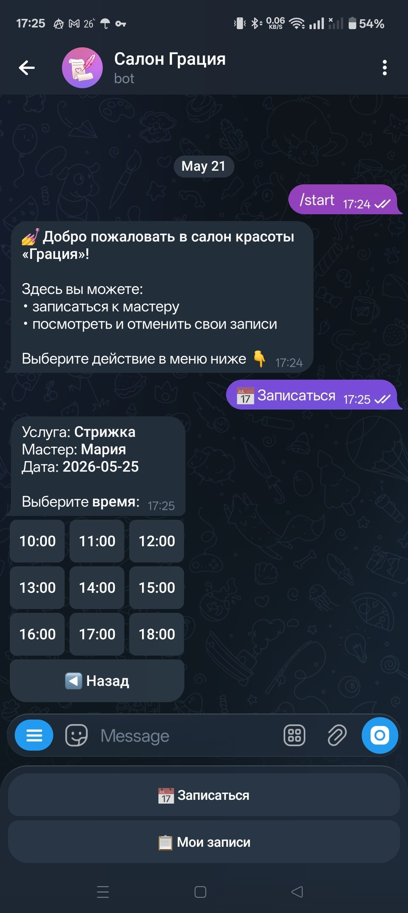
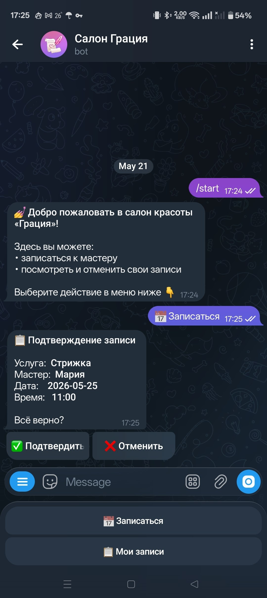
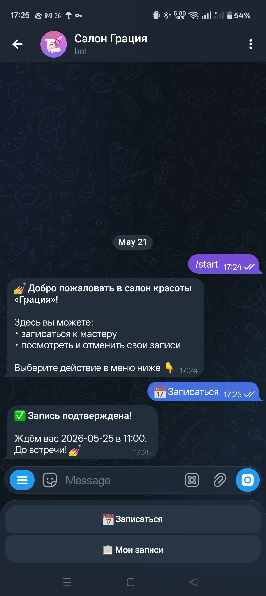
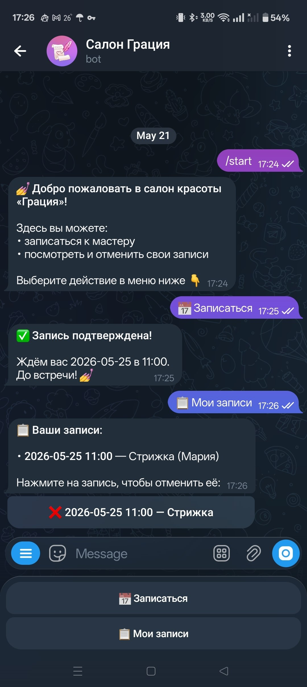
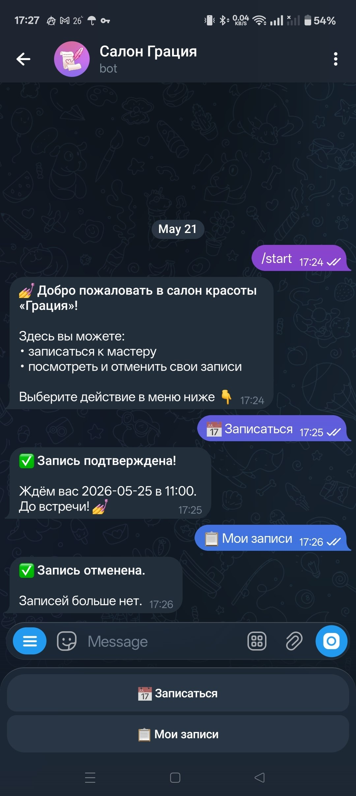
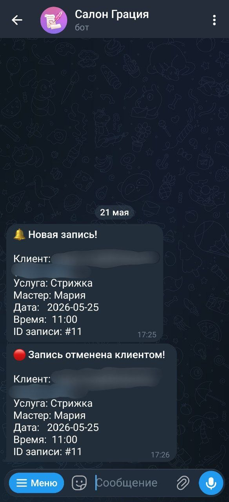

# 💅 Бот для записи в бьюти-салон

Telegram-бот для онлайн-записи клиентов в салон красоты. Написан на Python + aiogram 3.x.

## Демо

**Приветствие и выбор услуги:**




**Выбор мастера, даты и времени:**





**Подтверждение и результат:**




**Мои записи и отмена:**




**Уведомления менеджеру (новая запись и отмена клиентом):**



---

## Функционал

- `/start` — приветствие и главное меню
- **Запись** — пошаговый выбор: услуга → мастер → дата → время → подтверждение
- **Мои записи** — просмотр и отмена активных записей
- **Уведомления менеджеру** — при новой записи и при отмене клиентом
- **SQLite** — данные хранятся локально, без сервера БД

## Стек

| Технология   | Версия  |
| ------------ | ------- |
| Python       | 3.11+   |
| aiogram      | 3.27.0  |
| aiosqlite    | 0.20.0  |
| python-dotenv| 1.2.2   |

## Структура проекта

```text
├── bot/
│   ├── handlers/
│   │   ├── start.py        — /start и главное меню
│   │   ├── booking.py      — FSM-процесс записи
│   │   └── my_bookings.py  — просмотр и отмена записей
│   ├── data.py             — услуги, мастера, расписание
│   ├── database.py         — SQLite: инициализация и запросы
│   └── keyboards.py        — все клавиатуры
├── main.py                 — точка входа
├── .env.example            — пример переменных окружения
├── requirements.txt
└── README.md
```

## Установка и запуск

### 1. Клонировать репозиторий

```bash
git clone git@github.com:404iq/beauty-salon-bot.git
cd beauty-salon-bot
```

### 2. Создать виртуальное окружение

```bash
python -m venv venv
venv\Scripts\activate
```

### 3. Установить зависимости

```bash
pip install -r requirements.txt
```

### 4. Настроить переменные окружения

Скопировать `.env.example` в `.env` и заполнить:

```env
BOT_TOKEN=токен_от_BotFather
OWNER_CHAT_ID=ваш_chat_id
```

> Узнать свой `chat_id` можно через [@userinfobot](https://t.me/userinfobot)

### 5. Запустить

```bash
python main.py
```

## Что можно улучшить

- Проверка занятости слотов (сейчас все слоты всегда доступны)
- Хранить услуги и мастеров в БД с редактированием через admin-команды
- Напоминание клиенту за день до записи
- RedisStorage для FSM при деплое на сервер
